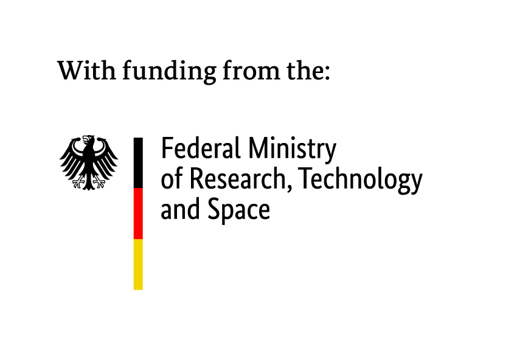
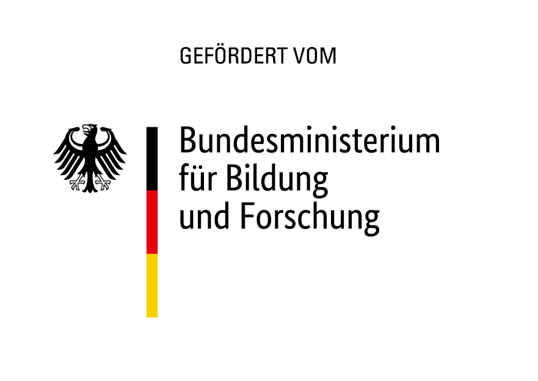

.. include:: literature.rst

Team
====

This page introduces the main developers and researchers behind MEmilio.

.. _core_developers:

Core Developers
---------------

.. _developer_1:

Martin Kühn
^^^^^^^^^^^

.. image:: https://martinkuehn.eu/research/images/martin.png
   :alt: Martin Kühn
   :width: 150px
   :align: left
   :class: developer-photo

**Research Focus:** High-Performance Computing, Energy-aware Computing, Numerical Analysis, Scientific Computing, Mathematical Modeling, Metapopulation Models, Integro-Differential Equation-based Models, Agent-Based Models, Hybrid Models, Machine Learning Surrogates

Martin Kühn studied at University of Cologne, Germany, and Université de Montréal, Canada, and obtained a PhD in Applied Mathematics from University of Cologne in 2018. He is affiliated with the Institute of Software Technology of the German Aerospace Center where he leads the group of Predictive Simulation Software and the University of Bonn where he does research on mathematical-epidemiological modeling. His research focuses on the design, analysis, and implementation of numerical methods in the context of high performance computing. Over the last five years, Martin Kühn has studied various models for the spread of infectious diseases, including SARS-CoV-2. He initiated the development of the MEmilio framework to support fast and reliable response to pandemic threats using mathematical models from ordinary and integro-differential equations, metapopulations, agent-based and hybrid metapopulation-agent-based models as well as machine learning surrogate models through, e.g., graph neural networks.

.. dropdown:: Selected Publications
   :animate: fade-in-slide-down

   * |MEmilio_citation|
   * |Traveler_estimation|   
   * |Missing_Transmission_Chains|
   * |Graph_Neural_Network_Surrogates|
   * |A_nonstandard_numerical_scheme|
   * |Revisiting_the_Linear_Chain|
   * |Risk-mediated_dynamic_regulation|
   * |Integrative_Modeling_of_the|
   * |Agent-based_modeling_for|
   * |Hybrid_metapopulation_agent-based|
   * |Novel_travel_time_aware_metapopulation_models|

.. dropdown:: Links
   :animate: fade-in-slide-down

   * `Google Scholar Profile <https://scholar.google.de/citations?user=OyOv8EAAAAAJ&hl=de&oi=ao>`__
   * `ORCID Profile: 0000-0002-0906-6984 <https://orcid.org/0000-0002-0906-6984>`__
   * `SCOPUS Author Profile <https://www.scopus.com/authid/detail.uri?authorId=57191842081>`__

.. _developer_2:

Henrik Zunker
^^^^^^^^^^^^^

.. image:: https://martinkuehn.eu/research/images/henrik.png
   :alt: Henrik Zunker
   :width: 150px
   :align: left
   :class: developer-photo

**Research Focus:** High-Performance Computing, Mathematical Modeling, Scientific Computing, Ordinary Differential Equations (ODEs)

Henrik Zunker is a PhD student at the Institute of Software Technology at the German Aerospace Center (DLR) since 2022. He is working on the development of MEmilio, focusing on equation-based models. In addition, he is involved in the development of machine learning models acting as surrogate models using various techniques (such as graph neural networks).

.. dropdown:: Selected Publications
   :animate: fade-in-slide-down

   * |MEmilio_citation|
   * |Traveler_estimation|     
   * |Risk-mediated_dynamic_regulation|
   * |Graph_Neural_Network_Surrogates|
   * |Novel_travel_time_aware_metapopulation_models|

.. dropdown:: Links
   :animate: fade-in-slide-down

   * `Google Scholar Profile <https://scholar.google.com/citations?user=gEng86kAAAAJ&hl=en>`__
   * `ORCID Profile: 0000-0002-9825-365X <https://orcid.org/0000-0002-9825-365X>`__

.. _developer_3:

Sascha Korf
^^^^^^^^^^^^^

.. image:: https://martinkuehn.eu/research/images/sascha.png
   :alt: Sascha Korf
   :width: 150px
   :align: left
   :class: developer-photo

**Research Focus:** High-Performance Computing, Mathematical Modeling, Scientific Computing, Agent Based Modeling (ABMs)

Sascha Korf is a PhD student at the Institute of Software Technology at the German Aerospace Center (DLR) since 2022. 
His background is in numerical mathematics, where he studied at the University of Cologne. He is interested in the development of agent-based models for infectious disease dynamics, especially in the context of high-performance computing.

.. dropdown:: Selected Publications
   :animate: fade-in-slide-down

   * |MEmilio_citation|
   * |Missing_Transmission_Chains|
   * |Agent-based_modeling_for|
   * |Integrating_Human_Mobility_Models|

.. dropdown:: Links
   :animate: fade-in-slide-down

   * `ORCID Profile: 0000-0002-1431-3046 <https://orcid.org/0000-0002-1431-3046>`__

Julia Bicker
^^^^^^^^^^^^

.. image:: https://martinkuehn.eu/research/images/julia.png
   :alt: Julia Bicker
   :width: 150px
   :align: left
   :class: developer-photo

**Research Focus:** Mathematical Modeling, Hybrid Modeling, High-Performance Computing, Agent-based Modeling, Ordinary Differential Equations (ODEs)

Julia Bicker is a PhD student at the Institute of Software Technology at the German Aerospace Center (DLR) since 2022. She focuses on the development of hybrid models that combine individual-based and population-based models, namely stochastic agent-based and ODE-based metapopulation models.

.. dropdown:: Selected Publications
   :animate: fade-in-slide-down

   * |MEmilio_citation|
   * |Hybrid_metapopulation_agent-based|
   * |Integrative_Modeling_of_the|

.. dropdown:: Links
   :animate: fade-in-slide-down

   * `Google Scholar Profile <https://scholar.google.com/citations?user=W0NCJ7MAAAAJ&hl=de&oi=ao>`__
   * `ORCID Profile: 0000-0001-9382-4209 <https://orcid.org/0000-0001-9382-4209>`__

Anna Wendler
^^^^^^^^^^^^

**Research Focus:** Mathematical Modeling, Integro-Differential Equations (IDEs), High-Performance Computing, Scientific Computing

Anna Wendler is a PhD student at the Institute of Software Technology at the German Aerospace Center (DLR) since 2022. She focuses on the development of models based on integro-differential equations that provide a generalization of models based on ordinary differential equations. 

.. dropdown:: Selected Publications
   :animate: fade-in-slide-down

   * |MEmilio_citation|
   * |A_nonstandard_numerical_scheme|
   * |Revisiting_the_Linear_Chain|

.. dropdown:: Links
   :animate: fade-in-slide-down

   * `Google Scholar Profile <https://scholar.google.com/citations?view_op=list_works&hl=de&user=NOvN9ucAAAAJ>`__
   * `ORCID Profile: 0000-0001-9382-4209 <https://orcid.org/0000-0002-1816-8907>`__

.. _developer_4:

Carlotta Gerstein
^^^^^^^^^^^^^^^^^

.. image:: https://martinkuehn.eu/research/images/carlotta.png
   :alt: Carlotta Gerstein
   :width: 150px
   :align: left
   :class: developer-photo

**Research Focus:** Agent-based modeling, Metapopulation models, Epidemiological modeling

Carlotta Gerstein completed her Bachelor's degree in Mathematics at the University of Bonn. To explore more applied areas, she continued with a Master's in Mathematics at the University of Cologne, where she focused on High Performance Computing. During her studies, she worked as a student assistant at the German Aerospace Center (DLR) in the Department of High-Performance Computing, where she focused on agent-based and metapopulation models to simulate the spatial spread of infectious diseases. In April 2025, she joined the research group of Prof. Jan Hasenauer as a PhD student at the University of Bonn. 

.. dropdown:: Selected Publications
   :animate: fade-in-slide-down

   * |MEmilio_citation|
   * |Agent-based_modeling_for|

.. dropdown:: Links
   :animate: fade-in-slide-down

   * `ORCID Profile: 0009-0004-4410-0502 <https://orcid.org/0009-0004-4410-0502>`__

Kilian Volmer
^^^^^^^^^^^^^^^^^

.. image:: https://martinkuehn.eu/research/images/kilian.png
   :alt: Kilian Volmer
   :width: 150px
   :align: left
   :class: developer-photo

**Research Focus:** Epidemiological modeling, Metapopulation models

Kilian holds a B.SC. and a M.SC. in Mathematics from the University of Bonn. During his Masters he worked as a research 
assistant in the group of Prof. Kevin Thurley and wrote his thesis on modeling immune cell interactions. In December 
2024 he joined the group of Prof. Jan Hasenauer at the Life and Medical Sciences Institute and the Bonn Center 
for Mathematical Life Sciences as a PhD student to work on infectious disease modeling.

.. dropdown:: Selected Publications
   :animate: fade-in-slide-down

   * |MEmilio_citation|

.. dropdown:: Links
   :animate: fade-in-slide-down

   * `ORCID Profile: 0009-0008-9861-0216 <https://orcid.org/0009-0008-9861-0216>`__

Maximilian Betz
^^^^^^^^^^^^^^^

**Research Focus:** Epidemiological modeling, Machine Learning, Automatic generation of Python bindings

Maximilian Betz completed his Bachelor's degree in Computer Science at the DHBW Mannheim as an integrated degree program with the Department of High-Performance Computing at the German Aerospace Center (DLR). Afterwards, he continued with a Master's in Computer Science at the University of Cologne, where he focused on Machine Learning and High Performance Computing. During the Master's, he kept working at the DLR as a student assistant with a focus on automatic generation of Python bindings, metapopulation models to simulate the spatial spread of infectious diseases and Machine Learning based parameter inference.

.. dropdown:: Selected Publications
   :animate: fade-in-slide-down

   * |MEmilio_citation|

René Schmieding
^^^^^^^^^^^^^^^

**Research Focus:** High-Performance Computing, Numerical Mathematics, Parallelization & Scalability, Software Design (C++)

René Schmieding completed both his Bachelor's and Master's degree at the University of Bonn in collaboration with the
German Aerospace Center (DLR), on applications in numerics and high-performance computing. He kept
working at the DLR on the development of MEmilio, focusing on parallelization and optimization of both the agent- and
equation-based models.

.. dropdown:: Selected Publications
   :animate: fade-in-slide-down

   * |MEmilio_citation|
   * |Traveler_estimation|
   * |Novel_travel_time_aware_metapopulation_models|
   * |Hybrid_metapopulation_agent-based|
   * |Integrating_Human_Mobility_Models|
   * |Revisiting_the_Linear_Chain|

.. dropdown:: Links
   :animate: fade-in-slide-down

   * `ORCID Profile: 0000-0002-2769-0270 <https://orcid.org/0000-0002-2769-0270>`__

David Kerkmann
^^^^^^^^^^^^^^

**Research Focus:** Mathematical Modeling, Agent Based Modeling (ABMs), Systems Immunology, Scientific Computing

David Kerkmann is a PostDoc at the Department of Systems Immunology at the Helmholtz Centre for Infection Research (HZI) in Braunschweig, Germany since 2022. He holds a PhD degree in Mathematics from the Heinrich Heine University Düsseldorf.
He is interested in the development of agent-based models for infectious disease dynamics, especially in the context of systems immunology and human behavior.

.. dropdown:: Selected Publications
   :animate: fade-in-slide-down

   * |MEmilio_citation|
   * |Agent-based_modeling_for|
   * |Novel_travel_time_aware_metapopulation_models|
   * |Integrative_Modeling_of_the|

.. dropdown:: Links
   :animate: fade-in-slide-down

   * `ORCID Profile: 0009-0007-9109-096X <https://orcid.org/0009-0007-9109-096X>`__

.. _former_core_developers:

Former Core Developers
----------------------   

Daniel Abele
^^^^^^^^^^^^

**Research Focus:** Scientific Computing, Software Architecture, Ordinary and Partial Differential Equations

Daniel Abele is a research software engineer at the Institute of Software Technology at the German Aerospace Center (DLR) and was part of the MEmilio team from its beginnings in 2020 until 2024. As one of its leading software engineers, he contributed to the early architecture of the code, including ODE and agent based models, as well as to the development processes and infrastructure. He left the project to focus on his PhD in numerical simulation of continental ice sheets.

.. dropdown:: Selected Publications
   :animate: fade-in-slide-down

   * |MEmilio_citation|
   * |Assessment_of_effective_mitigation|

.. dropdown:: Links
   :animate: fade-in-slide-down

   * `ORCID Profile: 0000-0001-7021-1573 <https://orcid.org/0000-0001-7021-1573>`__

Lena Plötzke
^^^^^^^^^^^

**Research Focus:** High-Performance Computing, Mathematical Modeling, Scientific Computing, Linear Chain Trick (LCT), Integro-Differential Equations (IDEs)

Lena Plötzke received her Bachelor's and Master's degrees from the University of Cologne in collaboration with the German Aerospace Center (DLR). Her bachelor's thesis examined models using integro-differential equations and her master's thesis focused on the Linear Chain Trick. She later authored a paper based on this research. Lena worked on the MEmilio software from September 2021 to January 2025.

.. dropdown:: Selected Publications
   :animate: fade-in-slide-down

   * |MEmilio_citation|
   * |A_nonstandard_numerical_scheme|
   * |Revisiting_the_Linear_Chain|

.. dropdown:: Links
   :animate: fade-in-slide-down

   * `ORCID Profile: 0000-0003-0440-1429 <https://orcid.org/0000-0003-0440-1429>`__

Khoa Nguyen
^^^^^^^^^^^
 
.. image:: https://martinkuehn.eu/research/images/khoa.png
   :alt: Khoa Nguyen
   :width: 150px
   :align: left
   :class: developer-photo
 
**Research Focus:**
 
Agent-Based Modeling, Computational Social Science, Mobility and Energy Transitions, Epidemiological Simulation, Policy-Oriented Simulation, Behavioural Decision Modeling

Khoa Nguyen obtained an MEng in Computing from Imperial College London and a PhD in Computer Science from Utrecht University, with a thesis on behavioural decision-making frameworks for agent-based models. He has held research positions at HES-SO Valais-Wallis, the Helmholtz Centre for Infection Research, and UniSanté in Lausanne, working at the intersection of computational modeling, public policy, and applied AI. His research focuses on the development and application of simulation models to study complex socio-technical systems, particularly in the domains of mobility, energy, infectious disease, and health services. Over the years, he contributed to developing and analyzing models for Swiss mobility demand (BedDeM), epidemic spread based on population mobility (PANDEMOS), and AI-driven digital navigation platforms in healthcare (UniSanté). His work spans multi-agent systems, micro–macro model coupling, and policy-oriented scenario analysis, leveraging agent-based, metapopulation-style, and hybrid approaches alongside modern data and AI pipelines.

 
.. dropdown:: Selected Publications
   :animate: fade-in-slide-down

   * |MEmilio_citation|
   * |Agent-based_modeling_for|
   * Nguyen, K. (2023). A Behavioural Decision-Making Framework For Agent-Based Models. PhD thesis, Utrecht University. https://dspace.library.uu.nl/handle/1874/425798.
   * Nguyen, K., Piana, V., and Schumann, R. (2022). Simulating bounded rationality in decision-making: an agent-based choice modelling of vehicle purchasing. In Conference of the European Social Simulation Association, pages 421–433. Springer. DOI: http://dx.doi.org/10.1007/978-3-031-34920-1_34 
   * Nguyen, K. and Schumann, R. (2021). An exploratory comparison of behavioural determinants in mobility modal choices. In Ahrweiler, P. and Neumann, M., editors, Advances in Social Simulation, pages 569–581, Cham. Springer International Publishing. DOI: https://doi.org/10.1007/978-3-030-61503-1_54
   * Nguyen, K. and Schumann, R. (2021). A socio-psychological approach to simulate trust and reputation in modal choices. In Uchiya, T., Bai, Q., and Marsá Maestre, I., editors, PRIMA 2020: Principles and Practice of Multi-Agent Systems, Lecture Notes in Computer Science, pages 39–54, Cham. Springer International Publishing. https://doi.org/10.1007/978-3-030-69322-0_3
   * Nguyen, K. and Schumann, R. (2020). A socio-psychological modal choice approach to modelling mobility and energy demand for electric vehicles. In Nguyen, K., Roman, R., and Schumann, R., editors, Proceedings of the 9th DACH+ Conference on Energy Informatics, volume 3 of Energy Informatics. Springer. DOI: https://doi.org/10.1186/s42162-020-00123-7
   * Nguyen, K. and Schumann, R. (2020). On developing a more comprehensive decision-making architecture for empirical social research: Lesson from agent-based simulation of mobility demands in Switzerland. In Paolucci, M., Sichman, J. S., and Verhagen, H., editors, Multi-Agent-Based Simulation XX, volume XX of International Workshop on Multi-Agent Systems and Agent-Based Simulation, pages 39–54, Cham. Springer International Publishing. DOI: https://doi.org/10.1007/978-3-030-60843-9_4
 
 
.. dropdown:: Links
   :animate: fade-in-slide-down
 
   * `Google Scholar Profile <https://scholar.google.com/citations?user=tVkA0eUAAAAJ>`__
   * `ORCID Profile: 0000-0002-3123-602X <https://orcid.org/0000-0002-3123-602X>`__

Margrit Klitz
^^^^^^^^^^^^^

.. image:: https://martinkuehn.eu/research/images/margrit.png
   :alt: Margrit Klitz
   :width: 150px
   :align: left
   :class: developer-photo

**Research Focus:** High-Performance Computing, Data Management, Digitalization, Software Development

Margrit Klitz holds a PhD in mathematics from the University of Bonn. She worked in the High-Performance Computing department at the German Aerospace Center (DLR) before joining the German Center for Neurodegenerative Diseases (DZNE), where she led IT and data management for the Rhineland Study. Since 2025, she heads the group “Digitalisation, Software, and AI” at the Space Agency at DLR. In the MEmilio project, she made the very first commit and supported the team through project coordination, scientific writing, and proposal development for PANDEMOS and LOKI-Pandemics.

.. dropdown:: Links
   :animate: fade-in-slide-down

   * `ORCID Profile: 0000-0003-3657-4180 <https://orcid.org/0000-0003-3657-4180>`__

Katrin Rack
^^^^^^^^^^^

**Research Focus:** High performance computing, machine learning, anomaly detection

Kathrin Rack studied physics at the University of Düsseldorf.  She holds a PhD. in theoretical physics from the University 
of Cologne for her work in computational biophysics at Forschungszentrum Jülich. Since 2015, she has been supporting the 
Institute for Software Technology at the German Aerospace Center. She was part of the MEmilio project from the beginning 
until end of 2021. During this period, she designed and developed the initial data-management component. Moreover, she 
integrated and steered the software-development process.

.. dropdown:: Links
   :animate: fade-in-slide-down

   * `ORCID Profile: 0000-0002-5794-5705 <https://orcid.org/0000-0002-5794-5705>`__

Agatha Schmidt
^^^^^^^^^^^^^^

.. image:: https://martinkuehn.eu/research/images/agatha.png
   :alt: Agatha Schmidt
   :width: 150px
   :align: left
   :class: developer-photo

**Research Focus:** Machine Learning, Surrogate Modelling, Graph Neural Networks, High-Performance Computing

Agatha Schmidt completed her Master's degree at the University of Cologne in collaboration with the German Aerospace Center (DLR), where she worked on machine learning-based surrogate models for ODE-based systems. After graduating, she continued her research by writing a paper focused on the application of graph neural networks as surrogate models. She was part of the team from May 2022 to December 2024. 

.. dropdown:: Selected Publications
   :animate: fade-in-slide-down

   * |MEmilio_citation|
   * |Graph_Neural_Network_Surrogates|

.. dropdown:: Links
   :animate: fade-in-slide-down

   * `ORCID Profile: 0009-0006-5766-8804 <https://orcid.org/0009-0006-5766-8804>`__

.. _contributors:

Further Active or Former Contributors
--------------------------------------

Paul Johannssen
^^^^^^^^^^^^^^^
 
**Research Focus:** ODE models, Runge-Kutta methods, reproduction numbers.
 
Paul Johannssen studied mathematics at the University of Bonn. He worked on the MEmilio project from March 2023 to March 2024 as a working student. In this time, he manually derived and implemented formulas in closed form for the computation of reproduction numbers in the ODE-based SEIR, SECIR, and SECIRVVS models.

Vincent Wieland
^^^^^^^^^^^^^^^^

.. image:: https://martinkuehn.eu/research/images/vincent.png
   :alt: Vincent Wieland
   :width: 150px
   :align: left
   :class: developer-photo

**Research Focus:** Stochastic Modeling, Bayesian Inference, Clinical Trajectory Analysis, Infectious Disease Modeling

Vincent Wieland is a PhD student at the Center for Mathematical Life Sciences in Bonn since 2023. Vincent holds a B.Sc. and a M.Sc. in Mathematics from the University of Bonn. In his Masters he focused on stochastic analysis and joined the group of Prof. Jan Hasenauer for his Master thesis. After the completion, he continued his education as a PhD student in the group working on stochastic modelling of disease progression and application to clinical data. 

.. dropdown:: Selected Publications
   :animate: fade-in-slide-down

   * |MEmilio_citation|

.. dropdown:: Links
   :animate: fade-in-slide-down

   * `Google Scholar Profile <https://scholar.google.com/citations?user=24SwK1EAAAAJ&hl=en&oi=sra>`__
   * `ORCID Profile: 0009-0003-9592-8871 <https://orcid.org/0009-0003-9592-8871>`__

We thank all contributors, who have contributed to MEmilio. For a complete list of contributors, please see our `GitHub Contributors page <https://github.com/SciCompMod/memilio/graphs/contributors>`__.

.. _collaboration:

Contributing research groups and institutes
-------------------------------------------

MEmilio has been developed by and in collaboration with various research institutions:

* **German Aerospace Center (DLR)** - Institute for Software Technology 
* **University of Bonn** - Life and Medical Sciences Institute and `Bonn Center for Mathematical Life Sciences <https://www.bcml.uni-bonn.de/>`__
* **Helmholtz Centre for Infection Research (HZI)** - Department of Systems Immunology
* **Forschungszentrum Jülich (FZJ)** - Institute of Climate and Energy Systems (ICE-1) and Institute of Bio- und Geosciences: Biotechnology (IBG-1)

.. _acknowledgments:

Acknowledgments
---------------

MEmilio has been supported by various project grants. Since 2020, MEmilio has been funded 

* by the Initiative and Networking Fund of the Helmholtz Association of German Research Institutions under grant agreement number KA1-Co-08 (Project LOKI-Pandemics),
* by the German Federal Ministry for Digital and Transport under grant agreement FKZ19F2211A and FKZ19F2211B (Project PANDEMOS),
* by the Helmholtz School for Data Science in Life, Earth and Energy (HDS-LEE),
* by German Federal Ministry of Education and Research under grant agreement 031L0297B (Project INSIDe),
* by the Deutsche Forschungsgemeinschaft (DFG, German Research Foundation) under grant agreement 528702961,
* by German Federal Ministry of Education and Research under grant agreement 031L0319A and 031L0319B (Project AIMS).

.. raw:: html

   

|bmftr| |helmholtz| |bmdv| |mfund| |bmbf| |hdslee|

.. raw:: html

   

