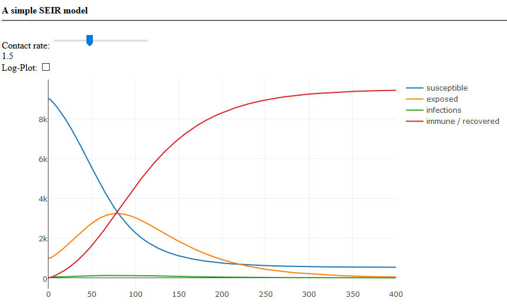

Simple SEIR model
=================

This is an utterly simple implementation of the SEIR epidemic model in Javascript using Tensorflow.

To test this small website, start a simple webserver via

    python -m http.server

inside this directory.

Then visit http://localhost:8000.
